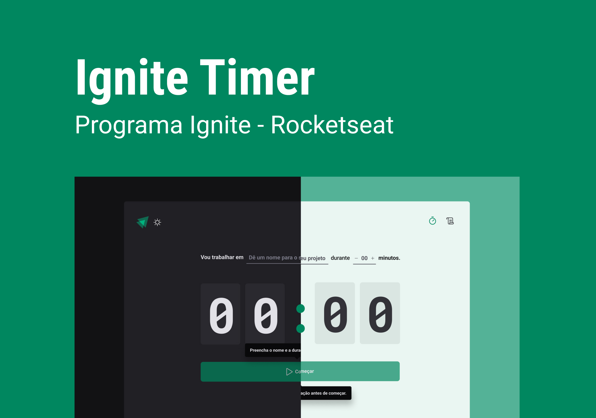

<h1 align="center"> Ignite Timer </h1>

Segundo projeto desenvolvido durante o bootcamp Ignite da Rocketseat.

  <a href="#-tecnologias">Tecnologias</a>&nbsp;&nbsp;&nbsp;|&nbsp;&nbsp;&nbsp;
  <a href="#-projeto">Projeto</a>&nbsp;&nbsp;&nbsp;|&nbsp;&nbsp;&nbsp;
  <a href="#-layout">Layout</a>&nbsp;&nbsp;&nbsp;

 

  

## 🚀 Tecnologias

Esse projeto foi desenvolvido com as seguintes tecnologias:

- ReactJS
- Styled Components
- React Hook Form
- Zod
- React Router DOM
- Context API

## 💻 Projeto

O Ignite Timer é uma aplicação de pomodoro, onde podemos colocar qual tarefa vamos fazer e por quanto tempo iremos fazer. Também podemos visualizar o histórico pra saber quando uma tarefa foi iniciada, qual a duração de cada pomodoro e verificar o status atual (finalizado, em andamento ou interrompida).

## 🔖 Layout

Você pode visualizar o layout do projeto através [DESSE LINK](https://www.figma.com/file/7RnzAMy8yRyT3y7hXfToHt/Ignite-Timer?node-id=313%3A1874&t=IYbrgge4FtCmLvM2-1).

